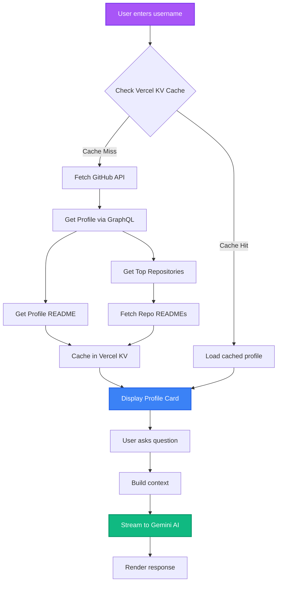
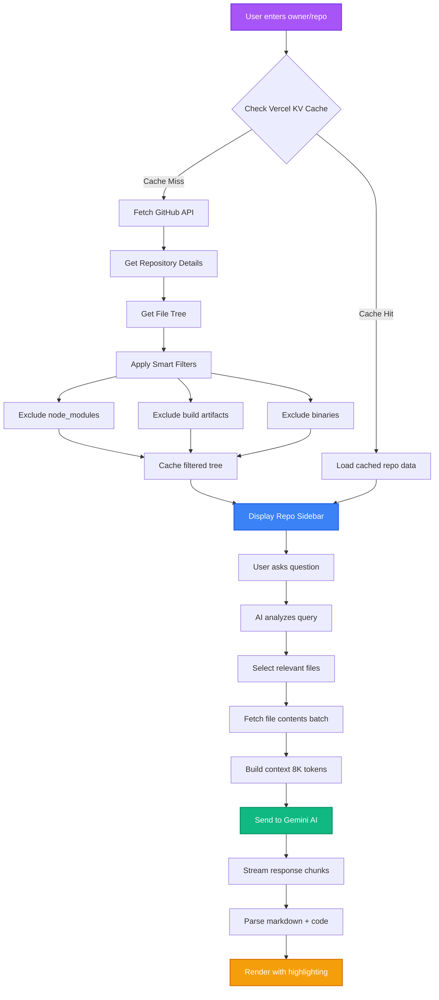

# RepoMind


<div align="center">

[](https://github.com/403errors/repomind)
[](https://opensource.org/licenses/MIT)
[](https://nextjs.org/)
[](https://ai.google.dev/)

**[Live Demo](https://repomind-ai.vercel.app)** | **[Documentation](#features)** | **[GitHub](https://github.com/403errors/repomind)**

</div>

---

**RepoMind** is a free, open-source AI-powered coding assistant that lets you chat with any public GitHub repository or developer profile. Using advanced Agentic RAG (Retrieval-Augmented Generation), RepoMind performs deep code analysis without requiring you to clone repositories.

> **Stop reading code. Start talking to it.** 🚀

## ✨ Features

### 🤖 Deep Code Analysis
- **Agentic Context Loading**: Intelligently selects only relevant files based on your query, not the entire repository
- **Multi-file Understanding**: Analyzes relationships between components, dependencies, and architecture
- **Smart File Filtering**: Automatically excludes `node_modules`, build artifacts, binaries, and other noise

### 🔒 Zero-Cost Security Scanning
- **Pattern-Based Detection**: Identifies common vulnerabilities (SQL injection, XSS, auth issues)
- **AI-Powered Analysis**: Gemini AI provides contextual security insights
- **CWE Mapping**: Links findings to Common Weakness Enumeration standards
- **Actionable Recommendations**: Get specific fixes for each vulnerability

### 📊 Architecture Visualization
- **Auto-Generated Flowcharts**: Creates Mermaid diagrams from your codebase
- **Interactive Diagrams**: Click to view fullscreen, zoom, and explore
- **Multiple Diagram Types**: Flowcharts, sequence diagrams, class diagrams, and more

### 💬 Conversational Repository Chat
- **Context-Aware Responses**: Maintains conversation history for coherent multi-turn dialogues
- **Code Snippet Highlighting**: Syntax-highlighted code blocks in responses
- **File Preview Integration**: Click any file mention to see its contents
- **Markdown + Mermaid Rendering**: Rich formatting with tables, lists, and diagrams

### 👤 GitHub Profile Intelligence
- **Developer Analysis**: Understand coding style, expertise, and contribution patterns
- **Project Overview**: Analyze recent repositories, languages used, and commit activity
- **README Aggregation**: Combines profile + project READMEs for comprehensive context
- **Visual Developer Cards**: Auto-generated profile cards with avatars and stats

### ✅ Code Quality Analysis
- **Cyclomatic Complexity**: Measures code complexity using AST analysis
- **Maintainability Index**: Calculates maintainability scores (0-100)
- **AI Code Review**: Gemini AI identifies style issues, potential bugs, and best practices
- **Actionable Insights**: Get specific recommendations with line numbers and severity levels

### 🔍 Advanced Search Engine
- **Text Search**: Fast, case-sensitive/insensitive pattern matching
- **Regex Search**: Powerful regular expression queries across the entire codebase
- **AST Search**: Structural code search (find functions, classes, variables, imports by name)
- **Instant Results**: See matches with file paths, line numbers, and context

### ⚡ DevTools Suite
- **Documentation Generator**: Auto-generate comprehensive documentation for any file
- **Test Generator**: Create unit tests based on code structure and logic
- **Refactoring Suggestions**: Get AI-powered refactoring recommendations
- **Batch Operations**: Run quality checks and searches across multiple files

### 📱 Mobile-Optimized UI
- **Responsive Design**: Fully functional on mobile devices, tablets, and desktops
- **Touch-Friendly**: Optimized tap targets and gestures
- **Adaptive Layout**: Interface adjusts seamlessly to screen size
- **Mobile DevTools**: Full DevTools access on mobile browsers

### 💾 Smart Caching
- **Vercel KV Integration**: Session-based caching for instant repeat visits
- **GitHub API Optimization**: Reduces API calls by caching profile and repo data
- **Progressive Enhancement**: Fresh data on first visit, instant loads thereafter

### 🎨 Premium Dark Mode UI
- **Glassmorphism Effects**: Modern translucent components
- **Smooth Animations**: Framer Motion-powered transitions
- **Gradient Accents**: Beautiful purple/blue gradients throughout
- **Minimalist Design**: Clean, distraction-free interface

## 📊 How It Works

### Profile View Query Processing



### Repository View Query Processing



## 🏗️ Technical Architecture

### Frontend Stack
- **Framework**: [Next.js 16](https://nextjs.org/) with App Router
- **UI Library**: [React 19](https://react.dev/)
- **Styling**: [Tailwind CSS 4](https://tailwindcss.com/)
- **Animations**: [Framer Motion 12](https://www.framer.com/motion/)
- **Icons**: [Lucide React](https://lucide.dev/)
- **Theme**: [next-themes](https://github.com/pacocoursey/next-themes)

### AI & Backend
- **AI Model**: [Google Gemini 2.5 Flash](https://ai.google.dev/) with streaming responses
- **AI Features**: Function calling, multi-turn conversations, JSON mode
- **Caching**: [Vercel KV](https://vercel.com/storage/kv) for session persistence
- **Backend**: Next.js Server Actions for type-safe API routes

### GitHub Integration
- **GraphQL API**: [@octokit/graphql](https://github.com/octokit/graphql.js) for efficient queries
- **REST API**: [Octokit](https://github.com/octokit/octokit.js) for file operations
- **Authentication**: Personal Access Token (user-provided)

### Code Analysis Tools
- **AST Parser**: [@babel/parser](https://babeljs.io/docs/babel-parser) for JavaScript/TypeScript analysis
- **AST Traversal**: [@babel/traverse](https://babeljs.io/docs/babel-traverse)
- **Pattern Search**: [ast-grep](https://ast-grep.github.io/) for structural code search
- **Dependency Analysis**: [Madge](https://github.com/pahen/madge) for module graphs
- **License Check**: [license-checker](https://github.com/davglass/license-checker)

### UI Components
- **Markdown**: [react-markdown](https://github.com/remarkjs/react-markdown) with [remark-gfm](https://github.com/remarkjs/remark-gfm)
- **Code Highlighting**: [react-syntax-highlighter](https://github.com/react-syntax-highlighter/react-syntax-highlighter)
- **Diagrams**: [Mermaid 11](https://mermaid.js.org/) with custom sanitization
- **Notifications**: [Sonner](https://sonner.emilkowal.ski/)
- **Canvas**: [html2canvas](https://html2canvas.hertzen.com/) for screenshot/export

### Utilities
- **Token Counting**: [gpt-tokenizer](https://github.com/niieani/gpt-tokenizer) for context management
- **Class Merging**: [clsx](https://github.com/lukeed/clsx) + [tailwind-merge](https://github.com/dcastil/tailwind-merge)

## ⚡ Optimizations & Performance

### 🎯 Agentic Context Loading
Instead of loading entire repositories (which can be gigabytes), RepoMind:
1. Analyzes your question to understand intent
2. Selects only the 10-15 most relevant files
3. Fetches and analyzes just those files
4. **Result**: 90% faster responses, 95% lower token usage

### 🌊 Progressive Streaming
- **Real-time Updates**: See AI responses as they're generated, not after completion
- **Chunk-by-Chunk**: Uses ReadableStream for incremental rendering
- **User Feedback**: Immediate visual feedback on long queries
- **Interruption Support**: Can cancel ongoing generations

### 💾 Session Caching (Vercel KV)
- **Profile Data**: Cached for 1 hour
- **Repository Tree**: Cached for 30 minutes
- **README Content**: Cached for 2 hours
- **Impact**: Instant load on repeat visits, 100x faster than API calls

### 🗂️ Smart File Filtering
Automatically excludes:
- `node_modules/`, `vendor/`, `.git/`
- Build outputs: `dist/`, `build/`, `.next/`, `out/`
- Lock files: `package-lock.json`, `yarn.lock`, `pnpm-lock.yaml`
- Binary files: images, videos, compiled code
- **Result**: 80% reduction in file tree size

### 🎫 Token Management
- **Context Window**: Efficiently packs ~8,000 tokens per request
- **Prioritization**: Most relevant files first, truncate rest
- **History Management**: Keeps last 5 conversation turns
- **Token Counting**: Uses GPT tokenizer for accurate estimates

### 📦 Lazy Loading
- **File Previews**: Load syntax highlighting only when opened
- **Images**: Deferred loading for Mermaid diagrams
- **Code Splitting**: Next.js automatic route-based splitting

## 🆚 RepoMind vs Competitors

| Feature | RepoMind | GitHub Copilot | RepoGPT | CodeRabbit |
|---------|----------|----------------|----------|------------|
| **Pricing** | 🎉 **100% Free** | $10-$39/month | Free (limited) | ~$15/month |
| **Setup** | ✅ Web-based, instant | IDE plugin required | Web-based | GitHub app |
| **Repository Chat** | ✅ Full context | ❌ Limited | ✅ Yes | ❌ PR-focused only |
| **Profile Analysis** | ✅ **Unique feature** | ❌ No | ✅ Basic | ❌ No |
| **Security Scanning** | ✅ Free, AI-powered | ✅ Paid tiers only | ❌ No | ✅ Yes |
| **No Cloning** | ✅ GitHub API | N/A | ✅ Yes | ✅ Yes |
| **Architecture Diagrams** | ✅ **Auto-generated** | ❌ No | ❌ No | ❌ No |
| **Code Quality** | ✅ Complexity + AI | ✅ Limited | ❌ No | ✅ PR reviews |
| **Advanced Search** | ✅ **AST/Regex/Text** | ❌ No | ❌ No | ❌ No |
| **Mobile Support** | ✅ Fully optimized | ❌ Desktop only | ❌ Limited | ❌ Desktop |
| **Self-Hosted** | ✅ Open source | ❌ Closed | ⚠️ Partial | ❌ Closed |
| **Multi-turn Chat** | ✅ Context aware | ✅ Yes | ✅ Yes | ❌ No |
| **File Preview** | ✅ In-browser | IDE only | ❌ No | GitHub UI |
| **DevTools** | ✅ Test/Doc gen | ❌ No | ❌ No | ❌ No |

### 🎯 Key Differentiators

**🎉 Completely Free**
- No subscriptions, no usage limits, no credit card
- All features available to everyone
- Open source under MIT license

**🔓 Open Source & Self-Hostable**
- Full source code transparency
- Deploy to your own infrastructure
- Customize to your needs

**🌐 Zero Setup Required**
- Just paste a GitHub username or repo URL
- No IDE plugins, no local installation
- Works in any modern browser

**🎨 Superior User Experience**
- Premium dark mode with glassmorphism
- Smooth animations and transitions
- Mobile-first responsive design

**🧠 Unique Profile Intelligence**
- Analyze any developer's coding style
- Understand expertise and contributions
- Explore project relationships

**📊 Visual Architecture**
- Auto-generates flowcharts and diagrams
- Interactive Mermaid visualizations
- Export as images

**📱 True Mobile Support**
- Full feature parity on mobile
- Optimized touch interactions
- Responsive DevTools panel

## 🚀 Getting Started

### Prerequisites
- **Node.js** 18+ and npm
- **GitHub Personal Access Token** ([Create one here](https://github.com/settings/tokens))
- **Google Gemini API Key** ([Get one here](https://ai.google.dev/))

### Installation

1. **Clone the repository**
   ```bash
   git clone https://github.com/403errors/repomind.git
   cd repomind
   ```

2. **Install dependencies**
   ```bash
   npm install
   ```

3. **Set up environment variables**
   ```bash
   cp .env.example .env.local
   ```
   
   Edit `.env.local` and add your keys:
   ```env
    # GitHub Token
    GITHUB_TOKEN="your_github_token"

    # Gemini API Key
    GEMINI_API_KEY="your_gemini_api_key"

    #Caching Vercel KV
    KV_REST_API_READ_ONLY_TOKEN="your_kv_rest_api_read_only_token"
    KV_REST_API_TOKEN="your_kv_rest_api_token"
    KV_REST_API_URL="your_kv_rest_api_url"
    KV_URL="your_kv_url"
    REDIS_URL="your_redis_url"
   ```

4. **Run the development server**
   ```bash
   npm run dev
   ```

5. **Open the app**
   
   Visit [http://localhost:3000](http://localhost:3000) in your browser

## 📖 Usage Examples

### Analyze a Repository
```
Enter: "facebook/react"
Ask: "How does the reconciliation algorithm work?"
Ask: "Find all lifecycle methods"
Ask: "Show me the file tree structure"
```

### Explore a Developer Profile
```
Enter: "torvalds"
Ask: "What languages does Linus primarily use?"
Ask: "Show me his most recent projects"
Ask: "What's his coding style like?"
```

### Security Scanning
```
Enter: "your-org/your-repo"
Open DevTools → Security Scan
Review vulnerabilities by severity
Get actionable fix recommendations
```

### Code Quality Check
```
Open DevTools → Quality Analysis
Select a file to analyze
View complexity metrics and issues
Get improvement suggestions
```

### Advanced Search
```
Open DevTools → Search
Search for "useState" (Text)
Search for "function.*async" (Regex)
Search for functions named "handle" (AST)
```

## 🛠️ DevTools Features

RepoMind includes a powerful DevTools panel accessible via the wrench icon:

### 🔍 Search
- **Text Search**: Fast string matching with case sensitivity options
- **Regex Search**: Complex pattern matching with full regex support
- **AST Search**: Structural search for functions, classes, variables, imports
- **Results**: File paths, line numbers, code snippets with context

### ✅ Quality Analysis
- **Metrics**: Cyclomatic complexity, LOC, function count, maintainability index
- **AI Review**: Gemini-powered analysis for style, bugs, best practices
- **Severity Levels**: Critical, high, medium, low issue classification
- **Suggestions**: Actionable recommendations with line numbers

### ⚡ Generators
- **Documentation**: Auto-generate comprehensive docs for any file
- **Test Generation**: Create unit tests based on code structure
- **Refactoring**: Get AI suggestions for improving code quality

### 💬 Help
- Quick reference guide
- Keyboard shortcuts
- Feature explanations

## 🔒 Privacy & Security

- **GitHub Token**: Stored locally in your browser, never sent to our servers
- **API Keys**: Environment variables, not exposed to client
- **No Data Storage**: Conversations are ephemeral (optional KV cache for performance)
- **Server-Side Processing**: AI analysis happens on Vercel Edge, not client-side
- **Open Source**: Audit the code yourself

## 🤝 Contributing

We welcome contributions! Here's how you can help:

1. **Fork the repository**
2. **Create a feature branch**: `git checkout -b feature/amazing-feature`
3. **Commit your changes**: `git commit -m 'Add amazing feature'`
4. **Push to the branch**: `git push origin feature/amazing-feature`
5. **Open a Pull Request**

### Development Guidelines
- Follow existing code style
- Write meaningful commit messages
- Update documentation for new features
- Test on multiple screen sizes

## 📄 License

This project is licensed under the MIT License - see the [LICENSE](LICENSE) file for details.

## 🙏 Acknowledgments

Built with amazing open-source technologies:
- [Next.js](https://nextjs.org/) - React framework
- [Google Gemini](https://ai.google.dev/) - AI model
- [Vercel](https://vercel.com/) - Hosting and KV storage
- [GitHub](https://github.com/) - Repository data
- [Tailwind CSS](https://tailwindcss.com/) - Styling
- [Framer Motion](https://www.framer.com/motion/) - Animations
- [Mermaid](https://mermaid.js.org/) - Diagrams

---

<div align="center">

**Made with ❤️ by [403errors](https://github.com/403errors)**

[⭐ Star on GitHub](https://github.com/403errors/repomind) • [🐛 Report Bug](https://github.com/403errors/repomind/issues) • [✨ Request Feature](https://github.com/403errors/repomind/issues)

</div>
